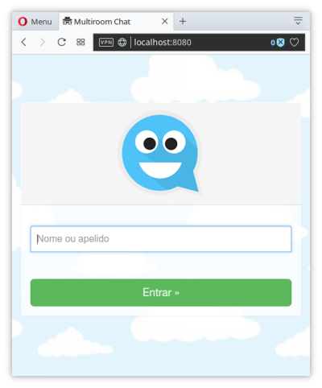
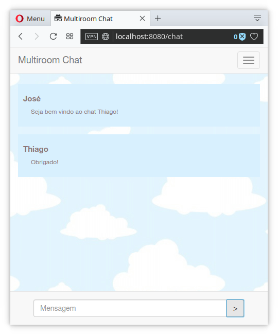
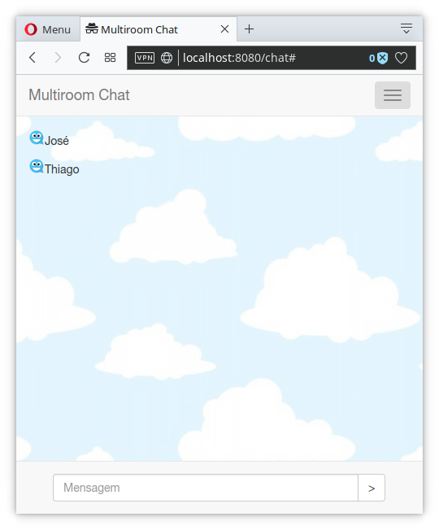
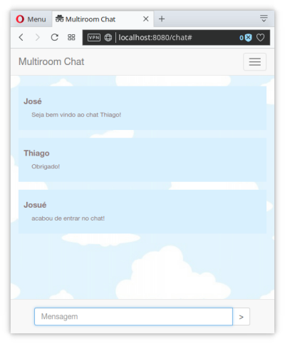

# Multiroom Chat real-time com WebSocket

Projeto desenvolvido no módulo 13 do [Curso Completo do Desenvolvedor NodeJS e MongoDB](https://www.udemy.com/curso-completo-do-desenvolvedor-nodejs).

Os objetos deste projeto são:

- Conhecer um pouco sobre WebSocket
- Conhecer e utilizar recursos do pacote socket.io
- Praticar outros conceitos já vistos
- Desenvolver um webchat simples

## Requisitos

Para rodar essa aplicação localmente serão necessários:
- node
- npm
- express
- ejs
- consign
- body-parser
- express-validator
- socket.io

## Screenshots da aplicação

## Versão 1.0
Este app não deve ganhar novas atualizações, visto que seu objetivo foi concluído.
